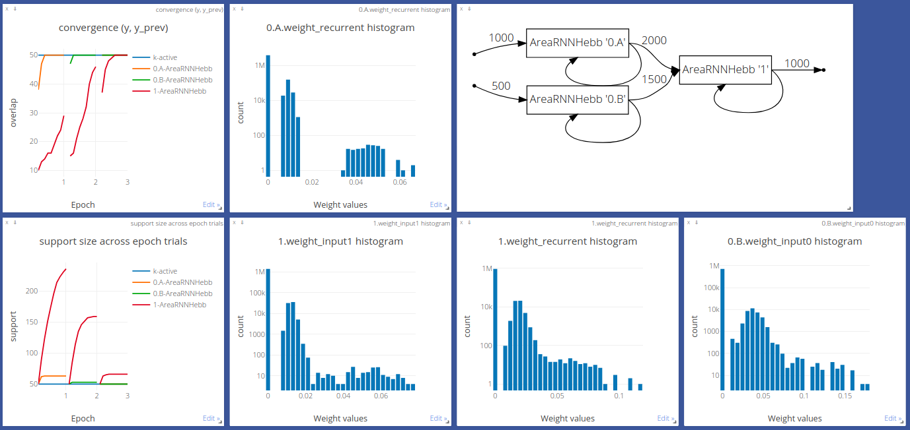

# Computation by assemblies of neurons

[](https://assemblies.readthedocs.io/en/latest/?badge=latest)

The PyTorch implementation of the *project* and *associate* operations [1].

Documentation: https://assemblies.readthedocs.io/en/latest

The visualization of `assembly/simulate.py` is at http://85.217.171.57:8097. Pick
*"2020.11.26 AreaSequential assemblies"* experiment from the drop-down list.



To reproduce the figures from the paper, switch to the [original](https://github.com/dizcza/assemblies/tree/original) (old) branch.

## Quick start

```
pip install -r requirements.txt
python assembly/simulate.py
```

## Implementation notes

The main building block is `AreaRNN` (see `assembly/areas.py`), simply called an area in the paper:
```python
class AreaRNN:
    """
    A recurrent neural network Area with one or more input layers (areas) and
    one output layer.

    Parameters
    ----------
    *in_features
        The sizes of input vectors from the incoming areas.
    out_features : int
        The size of the output layer.
    ...
    """

    def __init__(self, *in_features: int, out_features, p_synapse=0.05,
                    recurrent_coef=1., sampler=sample_bernoulli):
        ...

    def forward(self, xs_stim, y_latent=None):
        """
        The forward pass.

        Parameters
        ----------
        xs_stim : torch.Tensor or tuple of torch.Tensor
            Input vectors from the incoming areas.
        y_latent : torch.Tensor or None, optional
            The stored latent (hidden activations) vector from the previous
            step.
            Default: None

        Returns
        -------
        y_out : torch.Tensor
            The output vector.
        """
```

* There are two implementations of `AreaRNN` that correspond to two slightly different learning rules: `AreaRNNHebb` (as in the paper) and a particularly interesting `AreaRNNWillshaw` (see [2]) that forces the weight matrix to be binary.
* After each epoch, many repetitions of the same input trial, the weights  are normalized to have ``1.0`` in its pre-synaptic sum for each neuron, as stated in the paper.
* The layers are stateless (to follow the best practices in computer science), meaning that the previous activations `y_latent` are passed explicitly in the `forward` function defined above.
* The vector dimensionality and the number of active neurons are set to `N ~ 2000` and `k = 50`, which is closely related to the random projection & cut mechanism in a fruit fly [3].


## References

1. Papadimitriou, C. H., Vempala, S. S., Mitropolsky, D., Collins, M., &
   Maass, W. (2020). Brain computation by assemblies of neurons. Proceedings of
   the National Academy of Sciences.

2. Willshaw, D. J., Buneman, O. P., & Longuet-Higgins, H. C. (1969). 
   Non-holographic associative memory. Nature, 222(5197), 960-962.

3. Dasgupta, S., Stevens, C. F., & Navlakha, S. (2017). A neural algorithm for
   a fundamental computing problem. Science, 358(6364), 793-796.
