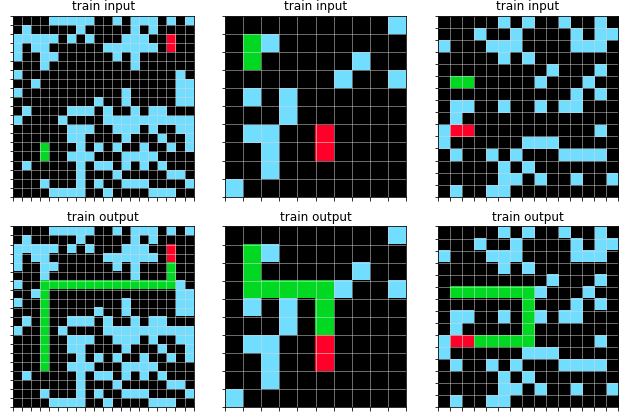
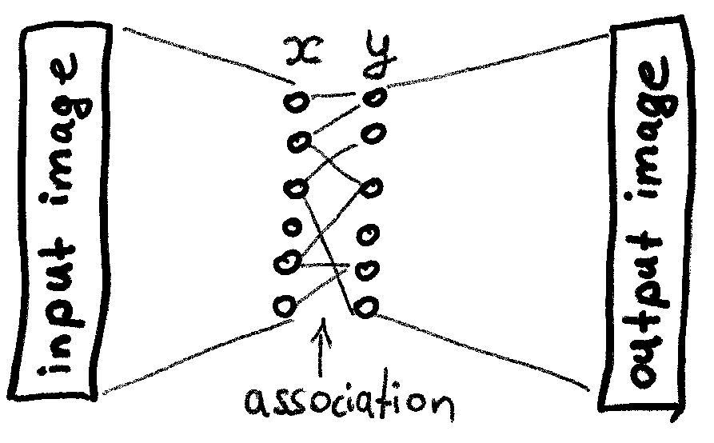

Solving a Kaggle competition
============================

Although Hebbian-Willshaw-Papadimitriou models are still considered as toy
models, they are well-suited for unsupervised tasks with relatively small
number of training examples failing artificial deep neural networks to
generalize. An example of such a task is a recent Kaggle competition
`Abstraction and Reasoning Challenge
<https://www.kaggle.com/c/abstraction-and-reasoning-challenge>`_.

**Disclaimer**

I'm the author of the proposed solution.

Task
----

The task is to correctly predict the image (all pixels must match, otherwise
it's a mismatch), given an unseen test image (as one of the images on the top
row) and up to 5 training example pairs. The tasks vary in their complexities
(e.g., filling, cutting, pattern completion, etc.) and image shapes.

Associative mechanism to solve the task
---------------------------------------

Limited state space (30x30 pixels, 10 colors), limited number of training
examples, the paired nature of samples (for each input image there is exactly
one correct corresponding output) suggests an associative mechanism described
in the :ref:`tutorial`: if we manage to convert input and output images into
meaningful binary `Sparse Distributed Representations
<https://discourse.numenta.org/t/sparse-distributed-representations/2150>`_
(SDRs) such that only a few cells need to be swapped in :math:`\bm{x}` and
:math:`\bm{y}` in order to associate them, in other words, :math:`\bm{x}` and
:math:`\bm{y}` SDR vectors differ a bit and in the same fashion across trials,
then a simple Willshaw's weight update rule such as the outer product of
:math:`\bm{x}` and :math:`\bm{y}` can associate input pairs and predict the
neurons needed to be swapped in an SDR representation :math:`\bm{x}'` of an
unseen image during the test.

Forming the SDRs
~~~~~~~~~~~~~~~~

The SDRs are formed by a random projection & cut or, in other words,
k-winners-take-all competition followed by multiplication by a learned matrix
:math:`\bm{W}`. The matrix is learned to reconstruct the input image given its
sparse representation :math:`\bm{x}` - a typical autoencoder problem,
constrained to have sparse binary embedding vectors.

The learned deep convolutional autoencoder is able to correctly reconstruct
*all* pixels from its SDR :math:`\bm{x}` in 97.3 % cases (see
"2020.05.14 AutoEncoderConvKaggleSample ..." environment at
http://85.217.171.57:8097/ ).

Results
~~~~~~~

How meaningful these SDRs are? It turned out that a simple
:math:`\bm{x} \otimes \bm{y}` update rule is not enough: the predictions do not
match 100%, leading to a mismatch as the competition rules state.
