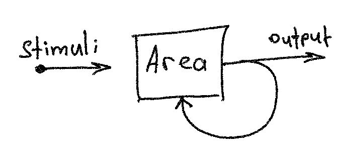
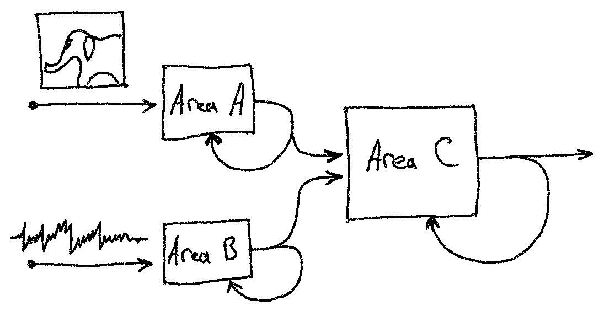
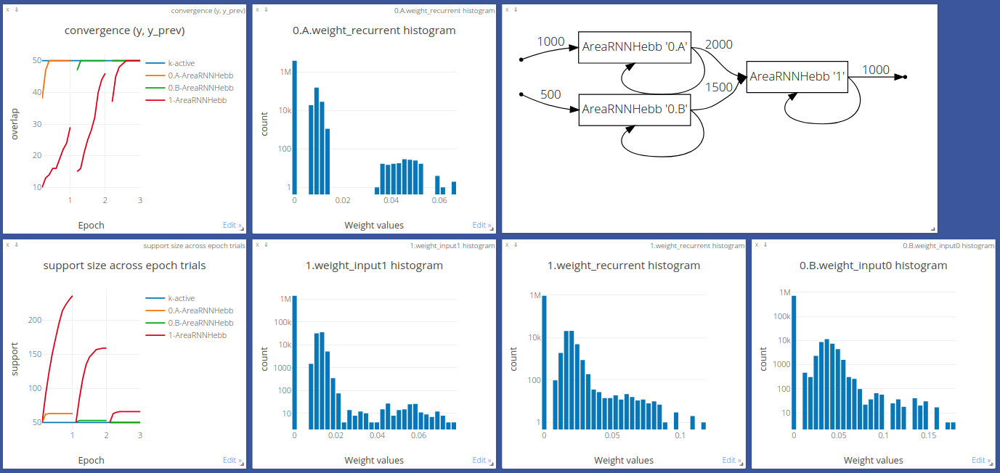

Tutorial
========

.. py:currentmodule:: assembly

A recurrent area cell
*********************

The building block of computation with assemblies [1]_ is a recurrent neural
network cell, called *area*, the forward pass of which is described in
:ref:`usage`. The output of such an area is a binary sparse vector, formed by
winner-take-all competition. For example, if an input vector multiplied by a
weight yields vector :code:`z = [-3.2, 4.6, 0, 0.7, 1.9]`, then
:code:`kwta(z, k=2) = [0, 1, 0, 0, 1]`.

K-winners-take-all
------------------

One of the properties of kWTA is that the inverse of kWTA is also kWTA, even
in case of a random projection (the multiplication matrix is random, not
learned). On the plot below, several images from MNIST dataset are shown
on the left, their random projection & cut binary vector
:math:`\bm{y} = \text{kWTA}(\bm{Wx}, k_y)`, reshaped as a matrix, in the
middle, and the restored :math:`\tilde{\bm{x}} = \text{kWTA}(\bm{W^T y}, k_x)`
is shown on the right. :math:`\text{dim}(\bm{y}) \gg \text{dim}(\bm{x})`
condition must hold in order to restore the input signal.

This example shows that a random projection & cut operation (kWTA followed by
multiplication by a random matrix) preserves enough information to
reconstruct the input signal.

How does the association work?
******************************

How to associate information from two and more different modalities? For example,
how to associate a picture of an elephant with the sound an elephant makes?

Willshaw's model
----------------

Let's define the task in mathematical terms: let `x` and `y` denote the image
and the sound representation vectors of a signal respectively. Then the
simplest way to associate `x` and `y` is to resort to the Hebbian-like learning
rule. Assuming both `x` and `y` are binary sparse vectors, we can construct
the weight matrix as an outer product of `x` and `y`. This technique is
described in [2]_ and implemented in :class:`AreaRNNWillshaw`.

The idea behind Willshaw's paper is based on the outer product property:

.. math::
    (\bm{x} \otimes \bm{y}) \bm{y} = \bm{x} * (\bm{y}\bm{y^T}) \propto \bm{x}

which naturally suggests the following update rule:

.. math::
    \begin{cases}
    \bm{W} = \bm{W} + \bm{x} \otimes \bm{y} \\
    \bm{W} = \Theta(\bm{W})
    \end{cases}

where :math:`\Theta(x) = 1 ~~ \text{if} ~~ x > 0`; otherwise, it's zero.

Papadimitriou's model
---------------------

Willshaw's update mechanism has a limitation: the initial matrix :math:`\bm{W}`
must be initialized with zeros, which poses biological plausibility problems.
To alleviate this, we can use a third layer `C` to indirectly associate the
parental layers `A` and `B`, as shown below.

Area `A` encodes images, and area `B` - sound. The output of `A` and `B` is
projected onto area `C`, which forms a combined image-sound representation.
After several such projections (forward passes), the assemblies `A-C` and `B-C`
become more and more overlapping - significantly more than by chance. This
process is called `association` and described in [1]_. Following the example above,
when areas `A` and `B` become associated, a sound an elephant makes will
reconstruct a memory of elephant pictures (and vice versa), stored in `B`,
assuming, of course, the presence of backward connections from area `C` to the
incoming areas, which is not covered in this tutorial.

Input areas `A` and `B` can, of course, represent signals of the same modality
that come from different cortical areas or layers.

Results
~~~~~~~

The example below shows area `C` activations, reshaped as matrices, when (from
left to right):

  - only `A` is active;
  - only `B` is active;
  - both `A` and `B` are active.

before and after the association mechanism described above. Overlapping
neurons are shown in green.

Before:

After:

More results
^^^^^^^^^^^^

More results are here: http://85.217.171.57:8097. Pick
*"2020.11.26 AreaSequential assemblies"* experiment from the drop-down list.

References
----------

.. [1] Papadimitriou, C. H., Vempala, S. S., Mitropolsky, D., Collins, M., &
   Maass, W. (2020). Brain computation by assemblies of neurons. Proceedings of
   the National Academy of Sciences.

.. [2] Willshaw, D. J., Buneman, O. P., & Longuet-Higgins, H. C. (1969).
       Non-holographic associative memory. Nature, 222(5197), 960-962.
